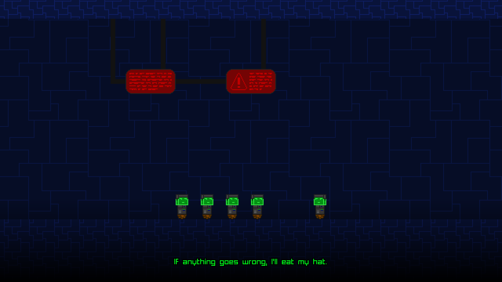

# Advanced Invasion

Advanced Invasion is a fangame of Blublub's Virus Invasion series. You can play
it on [Newgrounds](https://www.newgrounds.com/portal/view/project/1626557),
[itch](https://speedyvelcro.itch.io/advanced-invasion) or
[Game Jolt](https://speedyvelcro.itch.io/advanced-invasion).


## Compiling
**NOTE** This is for building the game from source code. If you just want to
play it, I recommend downloading/playing it on Newgrounds, Game Jolt or itch.

* Download Godot 4.7
* In the project manager, import the project.godot file and open the project.
* Project > Export
* Select the preset for your platform and click "Export Project".
* Find the exported project in the compiled folder. There are subdirectories for all the export presets.

You can alternatively create your own export preset.

## Release Process
The pipeline will automatically create releases and tags when you push
a main version tag to the repository. A main version tag is a tag in
the form `vX.X.X`, with no extra information appended.

GitHub does not provide a way to create tags through the UI without
creating a release. Creating a release triggers the pipeline to build
and package the game for that release, but it won't trigger tagging and
making releases for the Newgrounds and Game Jolt builds.

To reliably create all releases, checkout the repository and run the
following, replacing `vX.X.X` with your intended version:
```bash
git tag vX.X.X
git push origin tag v0.0.0
```

## License
Please see `LICENSE.md`. The following is just a summary.

**Note that this repository has some non-free content.** This is because it is a
fan-game of Blublub's Virus Invasion. Virus Invasion is abandonware with an
established history of allowing fangames.

Regardless, I've licensed as much fully original content as I can under free
licenses. And as for the rest, in general I am personally fine with people
redistributing or modifying it for non-commercial purposes, and I know Blublub
was generally fine with people making fangames before he disappeared. So use your
own discretion.
